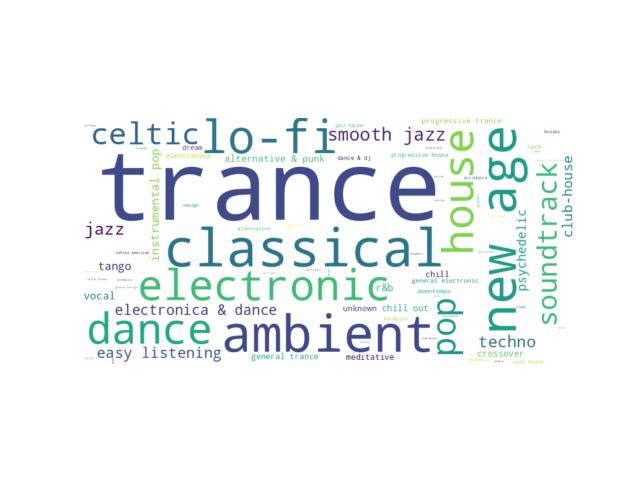

# pyVisualizeAudioTags

## General
pyVisualizeAudioTags reads a folder (and all subfolders recursivelly) of audio files
and gets audio tags to generate:
 * tag cloud of music genres (aggregated)

## Requirements and installation
pyVisualizeAudioTags requires Python 3.6. To install dependencies:

```
virtualenv -p python3.6 wordcloud-env
source wordcloud-env/bin/activate
git clone https://github.com/ferencek/pyVisualizeAudioTags.git
cd pyVisualizeAudioTags
pip install -r requirements.txt
```

## Usage
```
python main.py -i path/to/music/ -o genres.png
```

(use `python main.py -h` to see explanation of all command-line arguments)

## Examples
Genres tag cloud


